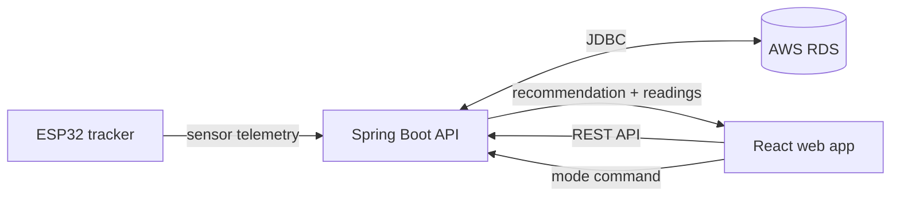

<div align="center">
  
  <h1>AutoLar</h1>
  <strong>Solar tracking · Made visible</strong>
  <br /><br />
  
  
  
  
</div>

<br />

## ☀️ Product

| | |
|---|---|
| **Purpose** | Monitor and control a dual-axis solar tracker |
| **Device** | ESP32 · LDR array · servo pan/tilt · INA219 |
| **Cloud** | Spring Boot REST API · AWS EC2 · AWS RDS |
| **Client** | Responsive React dashboard · desktop + mobile |

## ✨ Workspace

| Screen | Interface elements |
|---|---|
| **Dashboard** | Live/offline status · latest saved reading · sun-tracking panel · weather · cloud recommendation · power · voltage · current · LDR · history chart |
| **Analytics** | Timestamped telemetry · power, voltage, and current charts · sensor trends |
| **Energy History** | Historical readings · date range · recorded device values |
| **Assistant** | Cloud recommendation · reason · confidence · suggested tracker mode |
| **Device Control** | `TRACKING` / `STATIC` commands · current device mode |
| **Notifications** | Telemetry and recommendation alerts · local read/clear state |
| **Settings** | Cloud API address · device ID · browser-persisted configuration |
| **Account** | Demo sign-in and sign-up · profile menu · sign out |

## 🧭 Data path



## 🔌 API contract

| Method | Route | Dashboard use |
|---|---|---|
| `GET` | `/api/devices/{deviceId}/latest` | Latest telemetry and offline fallback |
| `GET` | `/api/devices/{deviceId}/telemetry?start=…&end=…` | Analytics and history |
| `GET` | `/api/devices/{deviceId}/recommendation` | Weather summary and assistant advice |
| `POST` | `/api/devices/{deviceId}/mode` | `{ "mode": "TRACK" }` or `{ "mode": "STATIC" }` |

## 🎨 Visual system

| Token | Treatment |
|---|---|
| **Forest** | Brand, navigation, and primary actions |
| **Sun gold** | Animated AutoLar mark and sunlight details |
| **Sage** | Calm page surfaces and selected states |
| **Solar blue** | Power, voltage, current, and chart accents |
| **Type** | Manrope display · DM Sans interface |
| **Motion** | Slow ray rotation · sun pulse · tracking panel tilt · staggered page entrance |
| **Accessibility** | `prefers-reduced-motion` · keyboard focus · touch-first mobile navigation |

## 🧱 Built with


## ▶️ Run locally

| Service | Directory | Start |
|---|---|---|
| **Backend** | `Autolar/backend` | `mvn spring-boot:run` |
| **Frontend** | `Autolar/frontend` | `npm install` → `npm run dev` |

```powershell
# Terminal 1 — backend; configure DB_URL, DB_USERNAME, DB_PASSWORD first
cd Autolar/backend
mvn spring-boot:run

# Terminal 2 — frontend
cd Autolar/frontend
npm install
npm run dev
```

## ⚙️ Configuration

| Setting | Where | Example |
|---|---|---|
| API base URL | Sign-in screen or Settings | `http://<EC2-host-or-domain>:8080/api` |
| Default API URL | `VITE_API_BASE_URL` | `http://localhost:8080/api` |
| Active device | Settings | `esp32_tracker_01` |
| Database | Backend environment | `DB_URL` · `DB_USERNAME` · `DB_PASSWORD` |
| Browser origin | Backend environment | `AUTOLAR_CORS_ORIGINS=https://your-site.example.com` |

- **EC2:** Elastic IP or DNS name for a stable API address
- **HTTPS deployment:** HTTPS API endpoint required by browser mixed-content rules
- **CORS:** Exact deployed frontend origin; no path or trailing slash
- **Telemetry refresh:** 5 seconds · last reading cached in this browser
- **Offline state:** Last known values remain visible · readings older than 30 minutes mark the device offline

## 🧪 Demo behavior

- Sign-in and sign-up: local demo gate; no user account API
- Notifications: generated from telemetry and recommendation responses
- Energy totals: not estimated without a sampling interval from the API
- Device commands: sent to the configured backend API
